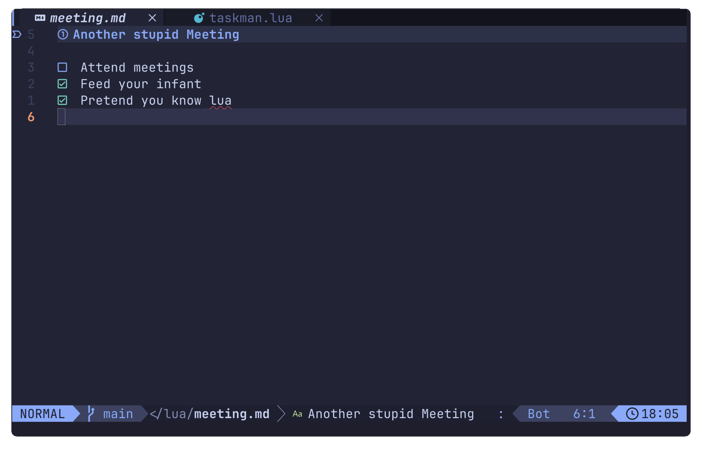

# taskman
A tiny Neovim plugin for extracting Markdown task lists (- [ ] and - [x]) from a directory and displaying them in vims native selection tool (vim.ui.select) with jump navigation and fuzzy finding.

 

Uses fast ripgrep (rg --vimgrep) and Neovim’s built-in quickfix parser.

## Installation
Install using your favorite package manager.

### Lazy
```lua
return {
  {
    "Jonathan-Al-Saadi/taskman",
    opts = {
      -- Directory to search for markdown task files
      task_dir = "~/Documents/YOUR-DIRECTORY-HERE",
    },
  },
}
```
## Features
- Find unfinished and finished tasks (- [ ] / - [x/X])
- Jump to file + line on selection
- Configurable root directory
- No dependencies 

### Confiugration
Set the task_dir (string) in opts. This should be the directory where your Markdown files live.

```lua
task_dir = "~/Documents/YOUR-DIRECTORY-HERE",
```

If omitted, it defaults to:

```vim
vim.fn.getcwd()
```

## Usage
`:TaskList`

Lists all incomplete tasks (default).

`:TaskList todo`

Same as above — incomplete tasks (- [ ]).

`:TaskList done`

Lists completed tasks (- [x], - [X]).

### Example
```markdown
# Meeting notes

- [ ] Write documentation
- [ ] Add Snacks picker support
- [x] Implement jump navigation
```
Running:

`:TaskList`
Shows:
```markdown
/path/file.md:3  - [ ] Write documentation
/path/file.md:4  - [ ] Add Snacks picker support
```
Running:
:TaskList done

Shows
```markdown
/path/file.md:5  - [x] Implement jump navigation
```
